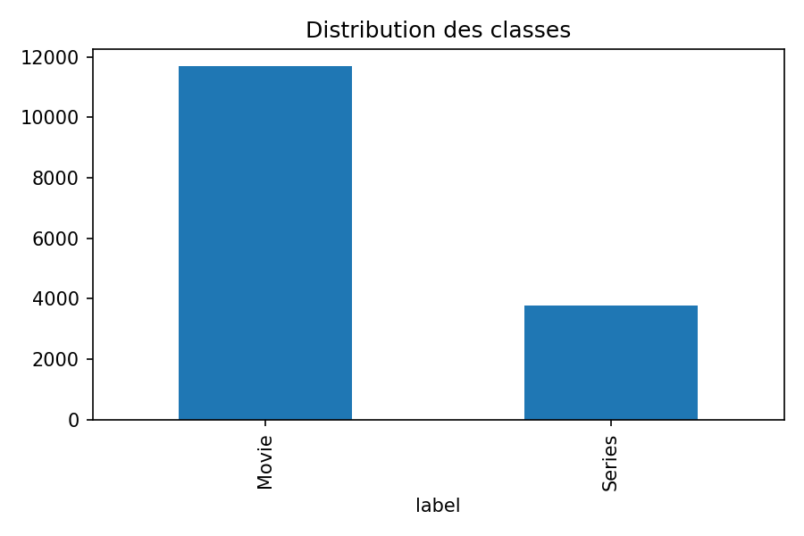
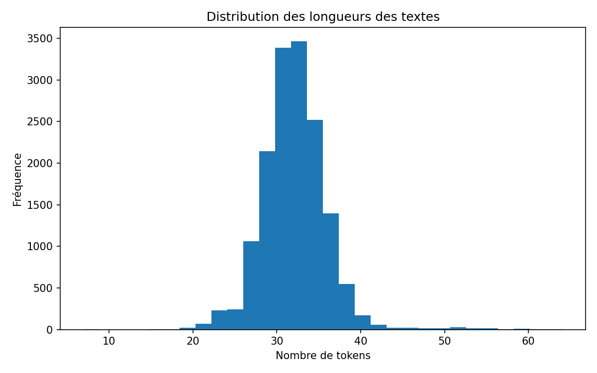
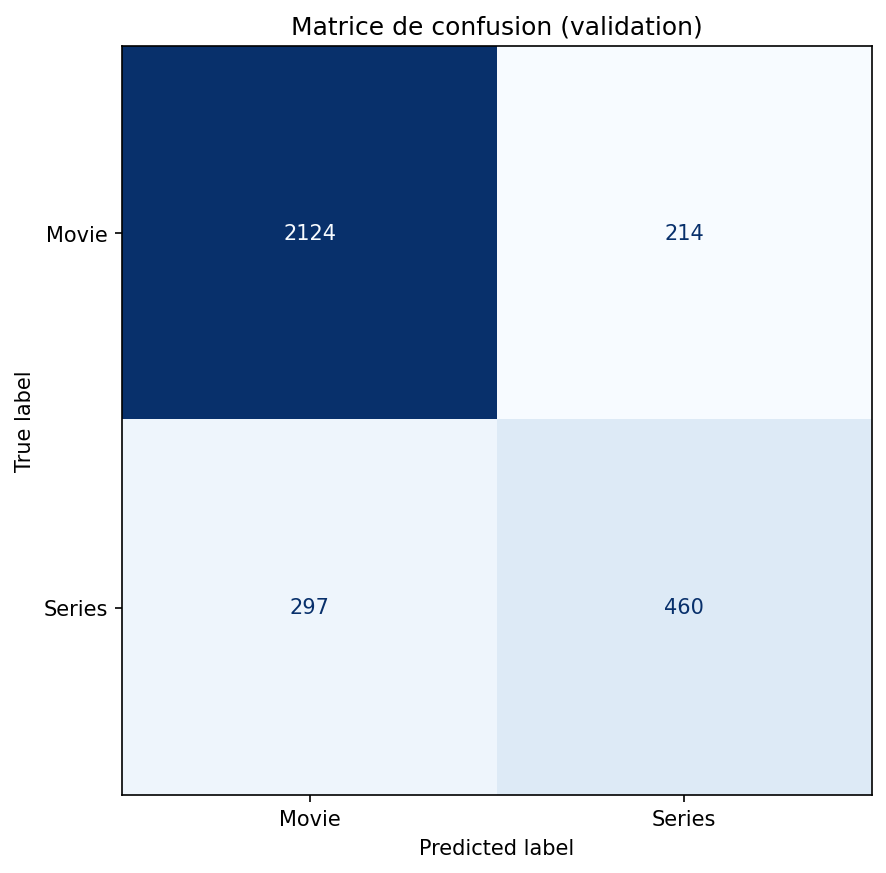
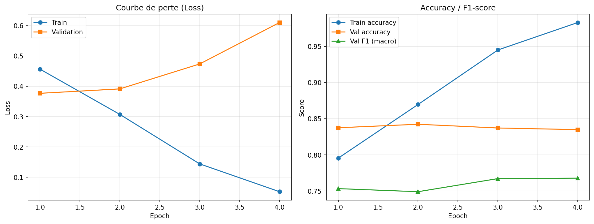

# Fine-Tuning de BERT pour la Classification de Contenus Netflix

## Binôme

- Étudiant 1 : FAYE MARIEME
- Étudiant 2 : NDIAYE ABDOURAHMANE

Master Intelligence Artificielle – Deep Learning

---

# 1. Présentation du projet

L'objectif de ce projet est de fine-tuner un modèle BERT pré-entraîné afin de classifier automatiquement les contenus Netflix en deux catégories :

- Movie
- Series

Le projet est réalisé en PyTorch en implémentant manuellement la boucle d'entraînement, sans utiliser le Trainer de Hugging Face.

# 2. Dataset

## 2.1 Description

Dataset Netflix Rotten Tomatoes Metacritic IMDb.

Variable cible : **Series or Movie**

Variable explicative : **Summary**

## 2.2 Statistiques générales

| Indicateur | Valeur |
|------------|---------|
| Nombre total d'exemples | 15471 |
| Nombre de classes | 2 |
| Classe 1 | Movie | 
| Classe 2 | Series | 

## 2.3 Distribution des classes

| Classe | Nombre |
|----------|--------|
| Movie | 11689 |
| Series | 3782 |



Le Ratio de déséquilibre est 3.09 (>2:1).

Stratégie face au déséquilibre : split train/validation stratifié (conserve la proportion des classes) et suivi du F1-core macro en plus de l'accuracy. La moyenne macro traite les deux classes à égalité, ce qui évalue honnetement la classe minoritaires (Series).
l'accuracy seule serait trompeuse : un modèle prédisant toujours "Movie" atteindrait déjà ~75% en ratant toutes les series

## 2.4 Analyse des longueurs des textes

| Mesure | Valeur |
|---------|---------|
| Longueur minimale | 7 tokens |
| Longueur maximale | 64 tokens |
| Longueur moyenne | 31.98  tokens |
| 95e percentile | 38 tokens |

Choix retenu : max_length = 128



# 3. Architecture du modèle

Modèle utilisé : **bert-base-uncased**
Ce modèle est choisi car les résumés sont en anglais; la variante "uncased" convient, la classe ne portant pas d'information discriminante. On récupère le vecteur du premier token de "last_hidden_state" comme representation de la séquence, puis une couche "nn.Linear(768, 2).

Architecture :

Texte → Tokenizer → BERT → [CLS] → Couche Linéaire → Prédiction

# 4. Prétraitement des données

- Tokenisation avec AutoTokenizer
- Padding
- Truncation
- Attention Mask
- Encodage des labels

Movie → 0

Series → 1

# 5. Découpage Train / Validation

- 80 % entraînement
- 20 % validation

Split stratifié.

# 6. Hyperparamètres

| Paramètre | Valeur |
|------------|---------|
| Modèle | bert-base-uncased |
| Batch Size | 16 |
| Epochs | 4 |
| Learning Rate | 2e-5 |
| Weight Decay | 0.01 |
| Optimiseur | AdamW |
| Max Length | 128 |
| Seed | 42 (random, numpy, torch |

# 7. Méthodologie d'entraînement

Calcul des métriques :

- train_loss
- val_loss
- train_accuracy
- val_accuracy
- val_f1_score

Sauvegarde du meilleur modèle selon la validation loss.

# 8. Résultats
 
##  Train Accuracy 
    98,3 %
##  Train Loss 
    5,2 %
## Validation Accuracy 
    83,4 %
## F1-score
    76,8 %
## Validation loss 
    61 %

## Matrice de confusion



## Courbes



# 9. Interface Gradio

Fonctionnalités :

- Saisie d'un résumé
- Prédiction Movie / Series
- Probabilités des classes
- Exemples pré-remplis

Lancement :

```bash
python demo.py
```

## Capture de l'interface Gradio en fonctionnement


# 10. Difficultés rencontrées

- Compréhension de BERT 
- Gestion de la tokenisation et du masque d'attention
- Gestion du déséquilibre des classes
- Optimisation de l'entraînement
- Déploiement avec Gradio

# 11. Répartition du travail

## Marieme FAYE

- Modèle BERT (model.py)
- Entraînement (train.py)
- Utilitaire (utils.py)
- Readme

## Abdourahmane NDIAYE

- Analyse exploratoire  (inspect_dataset.py)
- Dataset (dataset.py)
- Interface web avec gradio (demo.py)
- Readme

# 12. Installation

```bash
git clone https://github.com/MariemeFAYE/bert-classification-netflix-rotten-tomatoes-metacritic-imdb
cd bert-classification-netflix-rotten-tomatoes-metacritic-imdb
pip install -r requirements.txt
```

# 13. Exécution

## Analyse

```bash
python inspect_dataset.py
```

## Entraînement

```bash
python train.py
```

## Démo

```bash
python demo.py
```

# 14. Conclusion

Ce projet a permis de mettre en œuvre un pipeline complet de classification de texte basé sur BERT, depuis l'analyse des données jusqu'au déploiement via Gradio.
